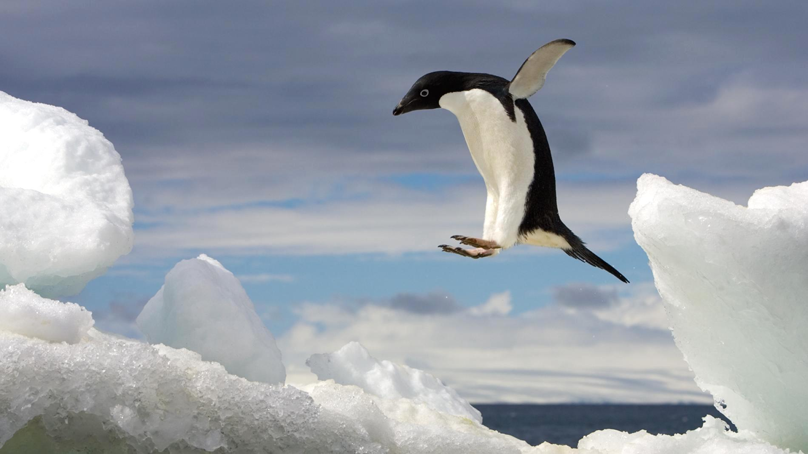
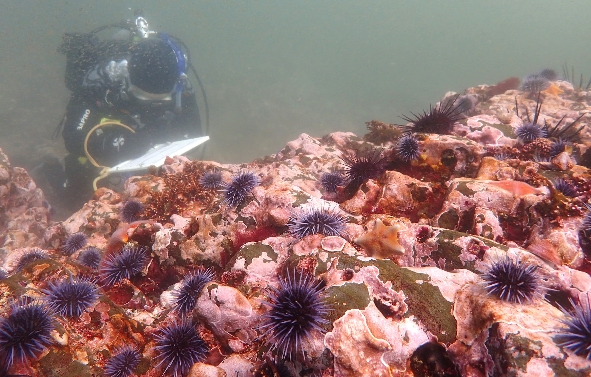

```{r setup, include=FALSE}
knitr::opts_chunk$set(echo = FALSE,
                      message = FALSE,
                      warning = FALSE,
                      fig.align = "center")
```

```{r}

library(tidyverse)
library(ggridges)
library(stargazer)
library(kableExtra)
library(janitor)
library(effsize)

```


## Task 1. Predicting penguin mass




Adelie Penguin (*Pygoscelis adeliae*) jumping into finals week. 
Credit: [Ralph Lee Hopkins, *National Geographic*](https://kids.nationalgeographic.com/animals/birds/adelie-penguin/)

```{r}

penguins <- read_csv("lter_penguin_species.csv")

```

Here we explored the potential for predicting penguin mass in Adelie, Chinstrap, and Gentoo penguins considering flipper length, sex, and species. We used data recorded at Palmer Station, LTER, Antarctica, compiled from the Environmental Data Initative (Gorman 2017).

```{r, include = FALSE}
penguins_relationships <- penguins %>% 
  filter(sex %in% c("FEMALE", "MALE")) %>% 
  mutate(sex = case_when(sex == "FEMALE" ~ "Female",
                         sex == "MALE" ~ "Male")) %>% 
  select(species, 
         sex,
         flipper_length_mm,
         body_mass_g)

## Explore the data

# species - cat
# sex - cat
# flipper length - num
# body mass - num

# scatter plot

ggplot(penguins_relationships) +
  geom_point(aes(x = flipper_length_mm,
                  y = body_mass_g,
                 color = sex),
             show.legend = FALSE) +
  facet_wrap(~species) +
  theme_minimal() 

# What is the difference in mean body mass and flipper length for each species/sex? 

penguins_summary <- penguins_relationships %>% 
  group_by(species, sex) %>% 
  summarize(mean_body_mass = mean(body_mass_g),
            mean_flipper_length = mean(flipper_length_mm))

penguins_summary

# density plot

ggplot(penguins_relationships) +
  geom_density(aes(x = flipper_length_mm,
                  fill = sex,
                  color = sex),
               alpha = 0.6,
               show.legend = FALSE) + 
  facet_wrap(~species,
             nrow = 3) + 
  theme_minimal()

# We can see that the relationships seem (and conceptually make sense to be) linear here. 

```


```{r}

# Create a factor for labels

penguins_relationships_ggplot <- penguins_relationships

penguins_relationships_ggplot$species <- factor(
  penguins_relationships_ggplot$species,
  levels = c("Adelie Penguin (Pygoscelis adeliae)",
  "Chinstrap penguin (Pygoscelis antarctica)",
  "Gentoo penguin (Pygoscelis papua)"),
  labels = c("Adelie Penguin \n (Pygoscelis adeliae)",
             "Chinstrap Penguin \n (Pygoscelis antarctica)",
             "Gentoo Penguin \n (Pygoscelis papua)"))

```


```{r, fig.height = 6}

# Final scatter plot

ggplot(penguins_relationships_ggplot) +
  geom_point(aes(x = flipper_length_mm,
                  y = body_mass_g,
                 color = sex),
             alpha = 0.8) +
  scale_color_manual(values = c("rosybrown3", 
                                "steelblue4")) +
  facet_wrap(~species,
             nrow = 3) +
  theme_minimal() +
  theme(legend.position = c(0.86, 0.86),
        legend.background = element_rect(fill = "white",
                                         color = "grey70",
                                         size = 0.2)) +
  labs(x = "Flipper Length (mm)",
       y = "Body Mass (g)",
       color = "Sex") 


```

***Figure 1.** Penguin species, sex, flipper length, and body mass. Data was recorded at Palmer Station, LTER, Antarctica and compiled from the Environmental Data Initiative (Gorman 2017)*

**Key Takeaways**

- There appears to be a positive correlation between body mass and flipper length among both sexes in all species. This makes sense intuitively, as both likely increase with penguin overall size (i.e. height). 
- Gentoo penguins are the largest in terms of both body mass and flipper length. Chinstrap and adelie penguins are similar to each other in these regards, though it is difficult to determine how similar due to relatively less data for Gentoo penguins. 
- In all three species, males tend to have a larger body mass and longer flipper length than females. 


```{r, include = FALSE}

# Our data appears linear and conceptually would make sense to be linear. So, let's see how a multi linear regression model works. 

## Multi linear regression model

penguins_lm <- lm(body_mass_g ~ flipper_length_mm + species + sex, data = penguins_relationships)
  
penguins_lm
summary(penguins_lm)

# Flipper length, sex, species: 
# Mass = -365.82 + 20.03(Flipper Length) - 87.63(Chinstrap) + 836.26(Gentoo) + 530.38(Male)
# R2 = 0.8669

penguins_lm_2 <- lm(body_mass_g ~ species + sex, data = penguins_relationships)

penguins_lm_2
summary(penguins_lm_2)

# Sex, species:
# Mass = -3372.39 + 26.92(Chinstrap) + 1377.86(Gentoo) + 667.56(Male)
# R2 = 0.8468

penguins_lm_3 <- lm(body_mass_g ~ flipper_length_mm + species, data = penguins_relationships)

penguins_lm_3
summary(penguins_lm_3)

# Flipper length, species:
# Mass = -4013.18 + 40.61(Flipper Length) -205.38(Chinstrap) + 284.52(Gentoo)
# R2 = 0.787

# Let's look at the AIC values...

AIC(penguins_lm)
# AIC = 4740.774  

AIC(penguins_lm_2)
# AIC = 4785.594

AIC(penguins_lm_3)
# AIC = 4895.267

# Thinking conceptually about these predictor variables, collinearity and interaction among terms are not an issue.

## penguins_lm (flipper length, sex, species) has the highest R2 value, lowest AIC value, AND makes the most sense conceptually (and considering our scatter plot), so we will go with that one.

```

***Table 1.** Summary of a multi-linear regression for predicting penguin body mass (g) with sex (male, female), flipper length (mm), and species (adelie, gentoo, chinstrap) as predictive variables. The data analyzed was recorded at Palmer Station, LTER, Antarctica and compiled from the Environmental Data Initiative (Gorman 2017)*

<center>

```{r, results = 'asis'}

stargazer(penguins_lm, 
          type = "html",
          dep.var.labels = c("Body Mass (g)"),
          covariate.labels = c("Flipper Length (mm)",
                               "Species: Chinstrap",
                               "Species: Gentoo",
                               "Sex: Male",
                               "Constant"))

```

</center>

```{r, include = FALSE}

# Check if assumptions of normality and homoscedasticity are satisfied

plot(penguins_lm)

# In residuals vs fitted, we see that the data mostly follows our assumptions. We can also see that the data is clearly grouped, likely by species or sex. We can also see here that the residuals don't seem to be correlated to each other. 
# QQ plot is beautifully linear! Linearity between actual and estimated values. Yay! 

```


We checked whether our model satisfies the assumption of homoscedasticity (constant variance) with a plot of residuals vs fitted values. The residuals appeared even on each side of the horizontal line, and therefore satisfy this assumption. In this plot, we can also see the data seems grouped (horizontally), likely due to differences among species and sex.  

We checked whether the residuals are normally distributed with a QQ plot. The QQ plot demonstrated a linear relationship, which confirms the residuals are normally distributed.

Our adjusted R^2^, or coefficient of determination, of 0.865 means that 86.5% of the variance in penguin body mass is predictable from penguin flipper length, species, and sex. 

- **Flipper Length**: we expect body mass to be 20.03g *more* on average for each 1mm increase in flipper length, if all other variables remain the same.
- **Species, Chinstrap**: we expect Chinstrap penguins to weigh 87.63g on average *less* than Adelie penguins, if all other variables remain the same. 
- **Species, Gentoo**: we expect Gentoo penguins to weigh 836.26g, on average, *more* than Adelie penguins, if all other variables remain the same.
- **Sex, Male**: we expect male penguins to weigh 530.38g, on average, *more* than female penguins, if all other variables remain the same.  


```{r, include = FALSE}

# Predict masses with the predict() function 

penguins_predictions_info <- data.frame(
  species = 
    c("Chinstrap penguin (Pygoscelis antarctica)",
      "Adelie Penguin (Pygoscelis adeliae)",
      "Gentoo penguin (Pygoscelis papua)"),
  sex = 
    c("Female",
      "Male",
      "Male"),
  flipper_length_mm = 
    c(195,
      205,
      220)
)

penguins_predictions <- predict(penguins_lm,
                              newdata = penguins_predictions_info)

penguins_predictions_table <- data.frame(
  penguins_predictions_info,
  penguins_predictions
) %>% 
  mutate(species = case_when(
    species == "Chinstrap penguin (Pygoscelis antarctica)" ~ "Chinstrap Penguin",
    species == "Adelie Penguin (Pygoscelis adeliae)" ~ "Adelie Penguin",
    species == "Gentoo penguin (Pygoscelis papua)" ~ "Gentoo Penguin"))

# Check actual results to double check we are in the right ballpark

penguins_actual <- penguins_relationships %>% 
  filter(
    species == "Chinstrap penguin (Pygoscelis antarctica)" &
      flipper_length_mm == (192:197) |
      species == "Adelie Penguin (Pygoscelis adeliae)" & 
      flipper_length_mm == (203:207) |
      species == "Gentoo penguin (Pygoscelis papua)" & 
      flipper_length_mm == (218:222)) 

penguins_actual_summary <- penguins_actual %>% 
  group_by(species) %>% 
  summarize(mean_body_mass = mean(body_mass_g))

penguins_actual_summary

# Chinstrap: actual = 3500, prediction = 3451
# Adelie: actual = 4300, prediction = 4270
# Gentoo: actual = 5164, prediction = 5406

# Pretty good!

```

***Table 2.** Predicted values for body mass (g) with our multi linear regression model. Predictive variables include species, sex, and flipper length (mm). Data was recorded at Palmer Station, LTER, Antarctica, compiled from the Environmental Data Initiative (Gorman 2017).*


```{r}

# Make a table with kableExtra to illustrate predictions 

kable(penguins_predictions_table,
      col.names = c("Species",
                    "Sex",
                    "Flipper Length (mm)",
                    "Predicted Body Mass (g)"),
      digits = 0,
      align = 'c') %>% 
        kable_styling(bootstrap_options = "hover")

```

## Task 2. Smoking effects on baby birth weight


```{r}

birthweights <- read_csv("nc_birthweights.csv") %>%
  select("tpounds", "lowbw", "smoke")

```

We analyzed the relationship between birth weight and whether women reported smoking during pregnancy by reviewing the proportions (Table 3) and testing significance with a chi-square test for independence. Birth weights were defined as low (below 5lb 8oz) or not low and responses to whether mothers smoked were categorized as yes or no. The data used was released by the state of North Carolina in 2004.

***Table 3.** Proportions and counts for low (< 5lb 8oz) and not low birth weights born to mothers who reported that they smoked or did not smoke during pregnancy. The data used was released by the state of North Carolina in 2004.*

```{r}

# Get the counts

birthweights_counts <- birthweights %>% 
  filter(smoke %in% c(0, 1)) %>% 
  count(lowbw, smoke) %>% 
  pivot_wider(names_from = lowbw, values_from = n) %>% 
   rename("Not Low Birth Weight" = "0",
         "Low Birth Weight" = "1")

# Making a table of proportions with janitor::adorn

birthweights_props <- birthweights_counts %>% 
  adorn_percentages(denominator = "row") %>% 
  adorn_pct_formatting(digits = 0) %>% 
  adorn_ns(position = "front") %>% 
  mutate(" " = case_when(
           smoke == "0" ~ "Did Not Smoke",
           smoke == "1" ~ "Smoked")) 

birthweights_props <- birthweights_props[, c(4, 2, 3, 1)] %>% 
  select(" ",
         "Not Low Birth Weight",
         "Low Birth Weight")

kable(birthweights_props,
      align = 'c') %>% 
  kable_styling(bootstrap_options = "hover")

```


```{r, include = FALSE}

# Chi-square test for independence

# Are the proportions within different levels in a group so different across multiple groups that we actually think there's an effect of group? Are birth weight and smoking independent? 

birthweights_chi_counts <- birthweights_counts %>% 
  select(-smoke)

birthweights_chi <- chisq.test(birthweights_chi_counts)

birthweights_chi 

# p = 0.27, we did not detect a significant difference in birth weight (normal or low) for people who smoked and did not smoke during pregnancy. 

# There is not a significant association between birth weight and smoking during pregnancy for the levels analyzed.

```


Both mothers that did not report smoking and that did had the majority of births at not low birth weight (`r birthweights_props$"Not Low Birth Weight"[1]` and `r birthweights_props$"Not Low Birth Weight"[2]`, respectively). We did not find a siginificant association between birth weight and smoking during pregnancy for the levels analyzed ($\chi^2$ (`r birthweights_chi$parameter`) = `r round(birthweights_chi$statistic, 2)`, p = `r round(birthweights_chi$p.value, 2)`).


This data may contain biases associated with the survey methods; for example, due to social pressure or errors in hindsight women may be inclined to claim that they did not smoke during pregnancy even if they did. Offering a Likert Scale would not only provide more data, but could also lessen this bias associated with a strict yes or no questionnaire. 


## Task 3. Visualizing UCSB campus profiles

```{r}

# Read in and tidy data

ucsb_profiles <- read_csv("ucsb_campus_profiles.csv") %>%
  pivot_longer(cols = starts_with("20"),
               names_to = "year",
               values_to = "students_count") %>% 
  clean_names() %>% 
  rename("ethnicity" = ethnicity_domestic_enrollment) 

```


```{r, include = FALSE}

# Exploration - here are unused graphs

ucsb_viz <- ucsb_profiles %>% 
  filter(!ethnicity == "Unknown",
         !students_count == "na") %>% 
  group_by(year, 
           ethnicity,
           student_level) %>% 
  summarize(students_count = sum(students_count))
  

ucsb_viz$year <- substr(ucsb_viz$year, 0, 4) %>% 
  as.numeric()

# Explore data

# Line graph

ggplot(ucsb_viz, aes(x = year,
                     y = students_count,
                     color = ethnicity)) +
  geom_line() +
  facet_wrap(~student_level) +
  scale_x_continuous(breaks = c(2008, 2010, 2012, 2014, 2016, 2018)) +
  theme_minimal() + 
  labs(x = "Year",
       y = "Number of Students",
       color = "Ethnicity")

ggsave("students_level.png",
       height = 4.5,
       width = 7.5)

# Area graph

ucsb_pct <- ucsb_viz %>% 
  group_by(year,
           student_level) %>% 
  mutate(students_pct = students_count / sum(students_count) * 100)

ggplot(ucsb_pct, aes(x = year,
                     y = students_pct)) +
  geom_area(aes(fill = fct_reorder(ethnicity, 
                                  students_pct,
                                  .desc = TRUE)),
            color = "black",
            alpha = 0.85,
            size = 0.3) +
  scale_x_continuous(breaks = c(2008, 2010, 2012, 2014, 2016, 2018)) + 
  theme_minimal() +
  facet_wrap(~student_level) +
  labs(x = "Year",
       y = "Percentage of UCSB Students",
       fill = "Ethnicity")

ggplot(ucsb_pct, aes(x = year,
                     y = students_pct)) + 
  geom_col(aes(fill = fct_reorder(ethnicity, 
                                  students_pct,
                                  .desc = TRUE))) + 
  facet_wrap(~student_level) + 
  theme_minimal() + 
  labs(x = "Year",
       y = "Percentage of UCSB Students",
       fill = "Ethnicity")

# Percents as line graph?

ggplot(ucsb_pct, aes(x = year,
                     y = students_pct)) + 
  geom_line(aes(color = ethnicity)) +
  facet_wrap(~student_level) +
  theme_minimal()

# Attempt to make cool two-sided bar graph for white vs. non-white undergraduates

ucsb_pct_undergrad <- ucsb_pct %>% 
  filter(student_level == "Undergraduate (individuals)") %>% 
  ungroup(student_level) %>% 
  select(year,
         ethnicity,
         students_pct)

ucsb_undergrad_white <- ucsb_pct_undergrad %>% 
  filter(ethnicity == "White") %>% 
  mutate(students_pct = -students_pct)

ucsb_undergrad_nonwhite <- ucsb_pct_undergrad %>% 
  filter(!ethnicity == "White") %>% 
  mutate(ethnicity = case_when(
    ethnicity == "Asian / Pacific Islander" ~ "Asian",
    ethnicity == "Black / African American" ~ "Black",
    ethnicity == "Chicano" ~ "Chicanx",
    ethnicity == "Latino" ~ "Latinx",
    T ~ "Other")) %>% 
    group_by(year,
           ethnicity) %>% 
  summarize(students_pct = sum(students_pct))

ggplot() + 
  geom_col(data = ucsb_undergrad_nonwhite, 
           aes(x = year,
               y = students_pct,
               fill = ethnicity),
           alpha = 0.9,
           color = "grey70",
           size = 0.25) +
  geom_col(data = ucsb_undergrad_white, 
           aes(x = year,
               y = students_pct,
               fill = ethnicity),
           alpha = 0.9,
           color = "grey70",
           size = 0.25) +
  geom_hline(aes(yintercept = 0),
             color = "grey75",
             size = 0.6) +
  scale_fill_brewer(palette = "Blues") +
  scale_x_continuous(breaks = c(2008, 2010, 2012, 2014, 2016, 2018)) +
  scale_y_continuous(breaks = c(-50, -25, 0, 25, 50),
                     labels = abs) +
  theme_minimal() +
  theme(plot.margin = unit(c(1, 5.8, 1, 1), "lines"),
        legend.position = c(1.11, 0.605)) +
  labs(x = "Year",
       y = "Percentage of UCSB Undergraduate Students",
       fill = "Ethnicity")

```


We compared the percentage of white and minority students of total UCSB undergraduate students from 2008-2018 to demonstrate how the relative proportions are changing over time (Figure 2). Data is compiled from the annual UCSB Campus Profiles prepared by the Office of Budget and Planning through the Institutional Research, Planning, & Assessment Initiative (UCSB). This dataset includes graduate and undergraduate students; however, we only used data for undergraduate students. Additionally, this dataset provides data for eight categories of ethnicities; however, to simplify for our purposes, we grouped the two categories with the smallest proportions of the total (American Indian / Alaskan students and E. Indian / Pakistani) within the 'Other' category. Lastly, again to simplify, we titled the Asian / Pacific Islander category as 'Asian', but this category still includes Pacific Islander students.  


```{r}

# Final graph - vertical version of white v minority bars over time

ggplot() + 
  geom_col(data = ucsb_undergrad_nonwhite, 
           aes(x = year,
               y = students_pct,
               fill = ethnicity),
           alpha = 0.9,
           color = "grey70",
           size = 0.25) +
  geom_col(data = ucsb_undergrad_white, 
           aes(x = year,
               y = students_pct,
               fill = ethnicity),
           alpha = 0.9,
           color = "grey70",
           size = 0.25) +
  geom_hline(aes(yintercept = 0),
             color = "grey75",
             size = 0.5) +
  scale_fill_brewer(palette = "Blues") +
  scale_x_reverse(breaks = seq(2008, 2018, by = 1)) +
  scale_y_continuous(breaks = c(-50, -25, 0, 25, 50),
                     labels = abs) +
  theme_minimal() +
  theme(plot.margin = unit(c(1.25, 5, 1, 1), "lines"),
        legend.position = c(1.08, 0.5),
        panel.grid.minor.y = element_blank()) +
  
  coord_flip() +
  labs(x = "Year",
       y = "Percentage of UCSB Undergraduate Students",
       fill = "Ethnicity") +
  annotate("text",
           x = 2008, y = -8.9, 
           label = "54.4%", color = "white", size = 3, hjust = 0) +
  annotate("text",
           x = 2009, y = -8.9, 
           label = "52.5", color = "white", size = 3, hjust = 0) +
  annotate("text",
           x = 2010, y = -8.9, 
           label = "50.4", color = "white", size = 3, hjust = 0) +
  annotate("text",
           x = 2011, y = -8.9, 
           label = "47.7", color = "white", size = 3, hjust = 0) +
  annotate("text",
           x = 2012, y = -8.9, 
           label = "44.8", color = "white", size = 3, hjust = 0) +
  annotate("text",
           x = 2013, y = -8.9, 
           label = "42.6", color = "white", size = 3, hjust = 0) +
  annotate("text",
           x = 2014, y = -8.9, 
           label = "40.1", color = "white", size = 3, hjust = 0) +
  annotate("text",
           x = 2015, y = -8.9, 
           label = "38.5", color = "white", size = 3, hjust = 0) +
  annotate("text",
           x = 2016, y = -8.9, 
           label = "37.9", color = "white", size = 3, hjust = 0) +
  annotate("text",
           x = 2017, y = -8.9, 
           label = "36.6", color = "white", size = 3, hjust = 0) +
  annotate("text",
           x = 2018, y = -8.9, 
           label = "35.8", color = "white", size = 3, hjust = 0) + # End of white
  annotate("text",
           x = 2008, y = 2.7, 
           label = "45.6%", color = "white", size = 3, hjust = 0) +
  annotate("text",
           x = 2009, y = 2.7, 
           label = "47.5", color = "white", size = 3, hjust = 0) +
  annotate("text",
           x = 2010, y = 2.7, 
           label = "49.6", color = "white", size = 3, hjust = 0) +
  annotate("text",
           x = 2011, y = 2.7, 
           label = "52.3", color = "white", size = 3, hjust = 0) +
  annotate("text",
           x = 2012, y = 2.7, 
           label = "55.2", color = "white", size = 3, hjust = 0) +
  annotate("text",
           x = 2013, y = 2.7, 
           label = "57.4", color = "white", size = 3, hjust = 0) +
  annotate("text",
           x = 2014, y = 2.7, 
           label = "59.9", color = "white", size = 3, hjust = 0) +
  annotate("text",
           x = 2015, y = 2.7, 
           label = "61.5", color = "white", size = 3, hjust = 0) +
  annotate("text",
           x = 2016, y = 2.7, 
           label = "62.1", color = "white", size = 3, hjust = 0) +
  annotate("text",
           x = 2017, y = 2.7, 
           label = "63.4", color = "white", size = 3, hjust = 0) +
  annotate("text",
           x = 2018, y = 2.7, 
           label = "64.2", color = "white", size = 3, hjust = 0) +
  annotate("text",
           x = 2007, y = -33,
           label = "Percent White Students", size = 3, hjust = 0) +
  annotate("text",
           x = 2007, y = 2.2,
           label = "Percent Minority Students", size = 3, hjust = 0)

ggsave("ucsb_undergrad_proportions.png",
       width = 7.5,
       height = 4.5)

```


```{r, include = FALSE}

# Information for percentages on graph

ucsb_undergrad_white

ucsb_nonwhite_sum <- ucsb_undergrad_nonwhite %>% 
  group_by(year) %>% 
  summarize(students_pct_sum = sum(students_pct))

ucsb_nonwhite_sum

```


***Figure 3.** Percentages of white and minority UCSB Undergraduate Students (2008-2018). The category titled 'Asian' includes Asian and Pacific Islander students. The majority of the students within the category titled 'Other' are American Indian / Alaskan students and E. Indian / Pakistani students. Data is compiled from the annual UCSB Campus Profiles prepared by the Office of Budget and Planning through the Institutional Research, Planning, & Assessment Initiative (UCSB). The format of this graph was inspired by [work from the Pew Research Center](https://www.pewresearch.org/fact-tank/2014/08/18/u-s-public-schools-expected-to-be-majority-minority-starting-this-fall/).*  

**Key Takeaways**

- At UCSB from 2008-2010, the percentage of white undergraduate students was higher than the percentage of all minority undergraduate students combined (>50%). 
- In 2011, the percentage of white undergraduate students was lower than the percentage of collective minority undergraduate students for the first time (in this data set). The percentage of collective minority students continued to increase 2011-2018.
- Much of the increase in the percentage of collective minority students is due to an increase in the percentage of Asian and Chicanx students. The percentage of Asian and Chicanx students increased by 7.9% and 6.0% from 2008 to 2018, respectively.


## Task 4. Purple urchins on the Santa Barbara coast

We explored size distributions of purple sea urchins (*Strongylocentrotus purpuratus*) at five sites along the Santa Barbara coast. The data is from SBC LTER long-term kelp removal experiment sites (Reed 2019). We only examined data from control treatments, where no kelp was removed.

<center>

 

</center>

Purple sea urchins (*Strongylocentrotus purpuratus*). Credit: Cynthia Catton, *California Department of Fish and Wildlife*

```{r}
# Read in and tidy data

urchins <- read_csv("sbc_lter_urchins.csv")

urchins_purple <- urchins %>% 
  clean_names() %>% 
  filter(treatment == "CONTROL",
         sp_code == "SPL") %>% # purple urchins only
  uncount(count) %>% 
  select(date,
         site,
         size,
         notes,
         common_name) %>%  
  mutate(site = case_when(
    site == "AQUE" ~ "Arroyo Quemado",
    site == "CARP" ~ "Carpinteria",
    site == "IVEE" ~ "Isla Vista",
    site == "MOHK" ~ "Mohawk",
    site == "NAPL" ~ "Naples"),
    date = lubridate::mdy(date))

```


***Table 4.** Summary of data for purple sea urchins in control treatments in five sites along the Santa Barbara Coast (2008-2018). Data is provided by SBC LTER (Reed 2019).* 


```{r}

# Make a data summary table

urchins_summary <- urchins_purple %>% 
  group_by(site) %>% 
  summarize(mean_size = mean(size),
            sd_size = sd(size),
            se_size = sd(size) / sqrt(n()),
            var = var(size),
            sample_n = n()) %>% 
  arrange(-mean_size)

kable(urchins_summary,
      col.names = c("Site",
                    "Mean Size",
                    "Standard Deviation",
                    "Standard Error",
                    "Variance",
                    "Sample Size"),
      digits = 2,
      align = 'c') %>% 
  kable_styling(bootstrap_options = c("hover", "striped"))

```


```{r}
# Exploratory graphs or purple urchin size distribution at each site

# Order sites by mean size

urchins_purple$site <- factor(urchins_purple$site, 
                              levels = c("Mohawk",
                                         "Arroyo Quemado",
                                         "Isla Vista",
                                         "Carpinteria",
                                         "Naples"))

# Size distribution graph

ggplot() + 
  geom_violin(data = urchins_purple, 
              aes(x = reorder(site, desc(site)),
                  y = size,
                  fill = site),
              color = "grey90",
              alpha = 0.75,
              show.legend = FALSE) +
  geom_point(data = urchins_summary, 
             aes(x = site,
                 y = mean_size),
             color = "grey10") +
  geom_errorbar(data = urchins_summary, 
                aes(x = site,
                    ymin = mean_size - sd_size,
                    ymax = mean_size + sd_size),
                width = 0.2,
                color = "grey10") +
  scale_fill_brewer() + 
  scale_y_continuous(limits = c(0, 10),
                     breaks = seq(0, 10, by = 2)) +
  coord_flip() + 
  theme_minimal() + 
  labs(x = "Site",
       y = "Size (cm)")

```

***Figure 4.** Urchin size distributions at five sites along the Santa Barbara coast (2008-2018). Error bars show the mean and standard deviation for urchin size. Data is provided by SBC LTER (Reed 2019).* 

**Key Takeaways**

- Mean urchin sizes and size distributions are very similar at Isla Visa, Carpinteria, and Naples, and only slightly larger at Arroyo Quemado.

- Mean urchin size is the largest at Mohawk. Mean urchin size at Mohawk is ~1.25cm more than at the site with the smallest mean urchin size, Naples, and ~ 0.75cm more than at the next largest site, Arroyo Quemado. 

```{r, include = FALSE}

# Urchin size over time graph

ggplot(urchins_purple, aes(x = date,
                           y = size)) + 
  geom_point(alpha = 0.05,
             color = "grey80") +
  geom_smooth(color = "steelblue4") +
  facet_wrap(~site,
             nrow = 5) + 
  theme_minimal() + 
  labs(x = "Date",
       y = "Size (cm)")

# There are not any apparent trends in urchin size over time in the five sites. 

```


```{r, include = FALSE}

# Check for significant different in mean purple urchin size at five sites with a one-way ANOVA

# We already saw in our data exploration that the data is normally distributed. Additionally, our sample sizes are big enough that the means will be normally distributed by the Central Limit Theorem. So, we satisfy this assumption.

# We saw in our summary table that variances are very close and that the largest variance (1.3) is less than 4x the smallest (0.89). So, we satisfy this assumption. 

# Yay! Let's do a one-way ANOVA.

urchin_aov <- aov(size ~ site, data = urchins_purple)

summary(urchin_aov)

urchin_aov_outputs <- data.frame(unlist(summary(urchin_aov))) %>% 
  rename("outputs" = unlist.summary.urchin_aov..)

urchin_aov_outputs

# p < 0.001, so the sizes are statistically significant. Let's see which sites specifically are different from each other with a post-hoc Tukey's HSD. 

# Post-hoc Tukey's HSD

urchin_tukey <- TukeyHSD(urchin_aov)

urchin_tukey_df <- data.frame(urchin_tukey$site) 

urchin_tukey

# They are all statistically different from each other. 

```


We analyzed observations for purple urchin size from 2008-2018 at all five sites (see Table 4 for means and standard deviations for each of the five sites). One-way ANOVA with post-hoc Tukey's HSD revealed a significant difference in mean urchin size across all five sites (F(`r round(urchin_aov_outputs$outputs[1], 2)`, 14940) =  `r round(urchin_aov_outputs$outputs[7], 2)`, *p* < 0.001 for all pair-wise comparisons). Table 5 provides a summary of the differences in mean urchin size (cm) among the pair-wise comparisons. 


***Table 5**. Differences in mean purple urchin size (cm) in among pair-wise comparisons from five sites along the Santa Barbara Coast (2008-2018) calculated in a post-hoc Tukey's HSD analysis. Size varied significantly among all sites (p < 0.001 for all comparisons). Rows are listed from largest to smallest mean urchin size and columns are listed from smallest to largest (see Table 4 for mean urchin sizes). Data is provided by SBC LTER (Reed 2019).*

```{r}

# Summary showing differences among pair-wise comparisons

urchin_tukey_diffs <- urchin_tukey_df %>% 
  select(diff)

# Make data frame with differences from Tukey's HSD

urchin_diffs_table_2 <- data.frame("site" = c("Mohawk",
                                            "Arroyo Quemado",
                                            "Isla Visa",
                                            "Carpinteria",
                                            "Naples"),
                                 "naples" = c("1.23",
                                              "0.52",
                                              "0.20",
                                              "0.12",
                                              " "),
                                "carpinteria" = c("1.12",
                                                   "0.41",
                                                   "0.08",
                                                   " ",
                                                   "-0.12"),
                                "isla_vista" = c("1.03",
                                                  "0.32",
                                                  " ",
                                                  "-0.08",
                                                  "-0.20"),
                                "arroyo_quemado" = c("0.71",
                                                      " ",
                                                      "-0.32",
                                                      "-0.41",
                                                      "-0.52"),
                                  "mohawk" = c(" ",
                                               "-0.71",
                                              "-1.03",
                                              "-1.12",
                                              "-1.23"))

kable(urchin_diffs_table_2,
      col.names = c("Site",
                    "Naples",
                    "Carpinteria",
                    "Isla Vista",
                    "Arroyo Quemado",
                    "Mohawk"),
      digits = 2,
      align = 'c') %>% 
  kable_styling(bootstrap_options = c("hover", "striped"))

                                 

```


## References

**Gorman K. 2017.** Structural size measurements and isotopic signatures of foraging among adult male and female Adélie penguins (Pygoscelis adeliae) nesting along the Palmer Archipelago near Palmer Station, 2007-2009. Environmental Data Initiative. https://doi.org/10.6073/pasta/abc50eed9138b75f54eaada0841b9b86.

**Gorman K. 2017.** Structural size measurements and isotopic signatures of foraging among adult male and female chinstrap penguins (Pygoscelis antarctica) nesting along the Palmer Archipelago near Palmer Station, 2007-2009. Environmental Data Initiative. https://doi.org/10.6073/pasta/2b1cff60f81640f182433d23e68541ce.

**Gorman K. 2017.** Structural size measurements and isotopic signatures of foraging among adult male and female gentoo penguins (Pygoscelis papua) nesting along the Palmer Archipelago near Palmer Station, 2007-2009. Environmental Data Initiative. https://doi.org/10.6073/pasta/409c808f8fc9899d02401bdb04580af7.

**Reed D. 2019.** SBC LTER: Reef: Long-term experiment: Kelp removal: Urchin size frequency distribution. Environmental Data Initiative. https://doi.org/10.6073/pasta/846569acc8745c133a44eac40245e6f0. 

**UCSB**. Campus Profiles, 2008-2018. Office of Budget and Planning. http://bap.ucsb.edu/institutional.research/campus.profiles/ 


